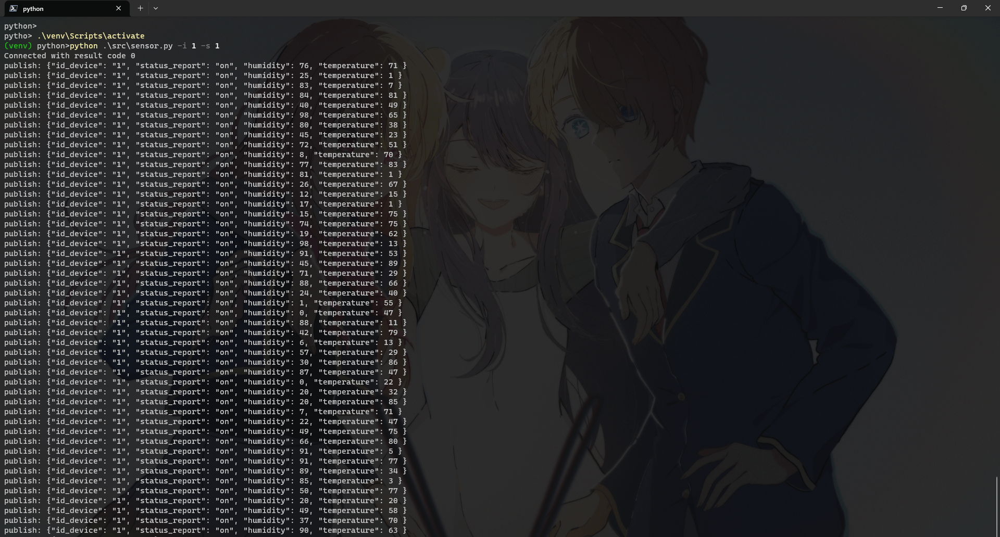

# Temperature Sensor Emulator

Aplicación para emular un sensor de temperatura y realizar puruebas en  
etapa de desarrollo.

## Prerrequisitos

≧◠‿◠≦

1. Instala Python 3.11 y PIP como herramienta de línea de comandos.
2. Conocimientos en entornos virtuales para Python.
3. Manejo de terminal y línea de comandos.
4. Requieres del siguiente repositorio
   [sensor-monitoring](https://github.com/miniscandal/sensor-monitoring) como aplicación web para  
   monitoreo en tiempo real.

## Instalación

≧◠‿◠≦

1. Clona el repositorio en tu computadora.  
   `git clone https://github.com/miniscandal/temperature-sensor-emulator`  
2. Abre una terminal en la carpeta del proyecto.
3. Ejecuta el comando `pip install -r requirements.txt` para instalar  
   los paquetes requeridos.
4. Ejecuta el comando `.\venv\Scripts\activate` para activar el entorno virtual.
5. Ejecuta el comando python .\src\sensor.py -i 1 -s 1 para inicar un emulador.

## Uso

≧◠‿◠≦

## Tecnologías

## Aprendizajes

≧◠‿◠≦

Implementación de un entorno virtual aislado para evitar conflictos  
de dependencias y prevenir la contaminación del sistema.

Integración de Python para realizar pruebas en aplicaciones web en tiempo real.

## Documentación

≧◠‿◠≦

* [Python](https://www.python.org/)
* [Mosquitto](https://mosquitto.org/)

## Licencia

≧◠‿◠≦

Este proyecto está bajo la Licencia MIT - mira el archivo LICENSE para detalles.